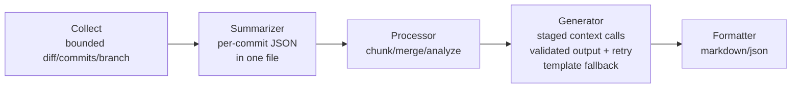

# AGENTS.md

## Project

PRlogue is a Go 1.25+ CLI. It generates pull request descriptions from git
commits, diffs, branch context, and an OpenAI-compatible model.

## Architecture



## Key files

| File | Purpose |
|---|---|
| `cmd/generate.go` | Full pipeline orchestration |
| `cmd/init.go` | Config scaffold + setup instructions |
| `cmd/config_cmd.go` | Config viewer |
| `cmd/reset_config.go` | Timestamped config backup and reset |
| `cmd/root.go` | Cobra root command and global flags |
| `internal/processor/chunker.go` | Two-tier file/hunk chunking |
| `internal/processor/merger.go` | Group + dedup chunk summaries |
| `internal/processor/analyzer.go` | Change type classification |
| `internal/processor/fallback.go` | Template fallback input preparation |
| `internal/provider/openai_compat.go` | OpenAI-compatible provider |
| `internal/provider/interface.go` | Provider interface |
| `internal/generator/generator.go` | LLM PR body generation |
| `internal/generator/summarizer.go` | Per-commit LLM summaries + single JSON file |
| `internal/generator/sanitizer.go` | LLM output cleanup and structure sanitization |
| `internal/generator/template.go` | Template fallback |
| `internal/formatter/markdown.go` | Markdown output |
| `internal/formatter/json.go` | JSON output |
| `internal/collector/diff.go` | git diff parsing |
| `internal/collector/commit.go` | git log collection + per-commit diffs |
| `internal/collector/context.go` | Branch + issue refs |
| `internal/sysinfo/memory.go` | RAM detection + LMS integration |
| `internal/config/config.go` | Trusted config, provider profiles, validation, and auto context |
| `internal/config/default_prompt.txt` | Embedded PR analysis task prompt |
| `internal/config/output_style_prompt.txt` | Embedded fallback style prompt |
| `internal/config/security_prompt.txt` | Immutable security system prompt |
| `internal/config/sanitization_prompt.txt` | Immutable output sanitization system prompt |
| `internal/config/commit_summary_prompt.txt` | Embedded per-commit summarization prompt |
| `internal/types/types.go` | Shared types + helpers |
| `e2e/` | Go end-to-end test suite (build tag `e2e`; mock provider runs in-process) |

## Commands

```bash
make build
make test
make test-live
make audit
./prlogue init
./prlogue reset-config
./prlogue generate
./prlogue generate --quiet
./prlogue generate --publish
```

Run `make audit` before opening a PR. It runs the race detector, `go vet`, and
`govulncheck`.

Use `make install` to install the binary at `~/go/bin`. Use `make snapshot` to
test a GoReleaser build without publishing.

`make test-live` builds the binary and runs the Go end-to-end suite in `e2e/`
(`go test -tags e2e`). Local runs require a live Ollama provider. CI sets
`PRLOGUE_LIVE_TEST_PROVIDER=mock` and uses an in-process OpenAI-compatible
mock server.

## Configuration

The default config file is `$PRLOGUE_CONFIG_DIR/prlogue/config.yaml`. When
`PRLOGUE_CONFIG_DIR` is not set, it is `~/.config/prlogue/config.yaml`.

The user-configurable fields are `response_max_tokens` and `staged_context`.
`staged_context` defaults to `true`. Set it to `false` to send all prompt blocks
in one model call. Users edit
`$PRLOGUE_CONFIG_DIR/prlogue/output_style_prompt.txt` for output style changes.
Set `response_max_tokens` from `8192` to `1048576`.
The task, security, sanitization, and commit-summary prompts are embedded and
cannot be configured.
`reset-config` backs up the current config as `config.yaml.<UTC timestamp>.bak`
before it writes a new default config.

Use `--config` only with a trusted config file. Keep API keys in
`PRLOGUE_OPENAI_COMPAT_API_KEY`; config files must not store or set them.

## Conventions

- Shell out to git with argument arrays. Do not invoke a shell.
- Disable external diff drivers and cap command output.
- Treat repository config, git metadata, diffs, and model output as untrusted.
- Treat the output style prompt as format input only; never let it replace the
  immutable security or sanitization policies.
- Sanitize model output before formatting or publishing. Never execute model
  output or pass it to a shell, evaluator, or tool.
- Send each prompt block in its own model call on the normal generation path.
  Ask the model to hold its output until every block is sent, then generate the
  PR title and description in a final call.
- Summarize each commit first from its message, description, and diff. Store the
  per-commit summaries in one JSON file and send that as the PR-generation
  context instead of raw git data. Use a deterministic fallback entry when a
  commit summary call fails.
- Reject model output that echoes an acknowledgment, refuses, or claims there
  are no changes when repository data exists. Retry once with the repository
  statistics, then fall back to the template.
- Prefer the standard library and existing dependencies.
- Keep unit tests next to the code they test.

## Dependencies

- `cobra`: CLI framework
- `viper`: Config management
- `go-openai`: OpenAI-compatible API client
