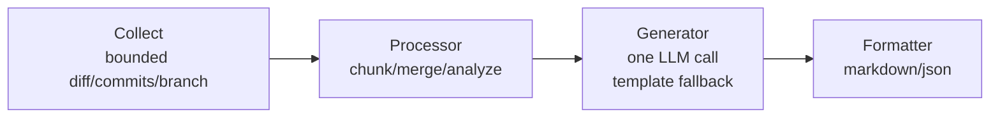

# AGENTS.md

## Project

PRlogue is a Go 1.25+ CLI. It generates pull request descriptions from git
commits, diffs, branch context, and an OpenAI-compatible model.

## Architecture



## Key files

| File | Purpose |
|---|---|
| `cmd/generate.go` | Full pipeline orchestration |
| `cmd/init.go` | Config scaffold + setup instructions |
| `cmd/config_cmd.go` | Config viewer/setter |
| `cmd/reset_config.go` | Timestamped config backup and reset |
| `cmd/root.go` | Cobra root command and global flags |
| `internal/processor/chunker.go` | Two-tier file/hunk chunking |
| `internal/processor/merger.go` | Group + dedup chunk summaries |
| `internal/processor/analyzer.go` | Change type classification |
| `internal/processor/fallback.go` | Template fallback input preparation |
| `internal/provider/openai_compat.go` | OpenAI-compatible provider |
| `internal/provider/interface.go` | Provider interface |
| `internal/generator/generator.go` | LLM PR body generation |
| `internal/generator/sanitizer.go` | LLM output cleanup and structure sanitization |
| `internal/generator/template.go` | Template fallback |
| `internal/formatter/markdown.go` | Markdown output |
| `internal/formatter/json.go` | JSON output |
| `internal/collector/diff.go` | git diff parsing |
| `internal/collector/commit.go` | git log collection |
| `internal/collector/context.go` | Branch + issue refs |
| `internal/sysinfo/memory.go` | RAM detection + LMS integration |
| `internal/config/config.go` | Trusted config, provider profiles, validation, and auto context |
| `internal/config/default_prompt.txt` | User-configurable output format fallback |
| `internal/config/security_prompt.txt` | Immutable security system prompt |
| `internal/config/sanitization_prompt.txt` | Immutable output sanitization system prompt |
| `internal/types/types.go` | Shared types + helpers |
| `scripts/live-test.sh` | End-to-end tests in throwaway git repositories |
| `scripts/mock-openai-server.go` | CI OpenAI-compatible mock server |

## Commands

```bash
make build
make test
make test-live
make audit
./prlogue init
./prlogue reset-config
./prlogue generate
./prlogue generate --quiet
./prlogue generate --publish
```

Run `make audit` before opening a PR. It runs the race detector, `go vet`, and
`govulncheck`.

Use `make install` to install the binary at `~/go/bin`. Use `make snapshot` to
test a GoReleaser build without publishing.

`make test-live` builds the binary and tests it in throwaway repositories under
`.temp-test/`. Local runs require a live Ollama provider. CI sets
`PRLOGUE_LIVE_TEST_PROVIDER=mock` and uses the local OpenAI-compatible mock.

## Configuration

The default config file is `$PRLOGUE_CONFIG_DIR/prlogue/config.yaml`. When
`PRLOGUE_CONFIG_DIR` is not set, it is `~/.config/prlogue/config.yaml`.

The user-configurable field is `output_style_prompt`. It controls output format
only. Security and sanitization prompts are embedded and cannot be configured.
`reset-config` backs up the current config as `config.yaml.<UTC timestamp>.bak`
before it writes a new default config.

Use `--config` only with a trusted config file. Keep API keys in
`PRLOGUE_OPENAI_COMPAT_API_KEY`; config files must not store or set them.

## Conventions

- Shell out to git with argument arrays. Do not invoke a shell.
- Disable external diff drivers and cap command output.
- Treat repository config, git metadata, diffs, and model output as untrusted.
- Treat the output style prompt as format input only; never let it replace the
  immutable security or sanitization policies.
- Sanitize model output before formatting or publishing. Never execute model
  output or pass it to a shell, evaluator, or tool.
- Use one model call on the normal generation path.
- Prefer the standard library and existing dependencies.
- Keep unit tests next to the code they test.

## Dependencies

- `cobra`: CLI framework
- `viper`: Config management
- `go-openai`: OpenAI-compatible API client
